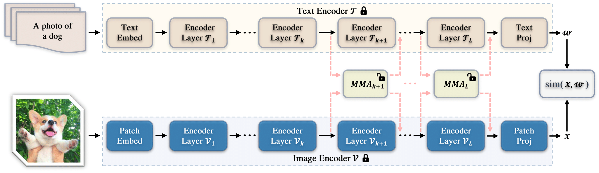

## [**MMA: Multi-Modal Adapter for Vision-Language Models (CVPR2024)**](https://openaccess.thecvf.com/content/CVPR2024/papers/Yang_MMA_Multi-Modal_Adapter_for_Vision-Language_Models_CVPR_2024_paper.pdf)<br>
[Lingxiao Yang](https://zjjconan.github.io/), [Ru-Yuan Zhang](https://ruyuanzhang.github.io/), [Yanchen Wang](https://ppwangyc.github.io/), [Xiaohua Xie](https://cse.sysu.edu.cn/content/2478)

## Highlights



> **<p align="justify"> Abstract:** Pre-trained Vision-Language Models (VLMs) have served as excellent foundation models for transfer learning in diverse downstream tasks. However, tuning VLMs for few-shot generalization tasks faces a discrimination — generalization dilemma, *i.e.*, general knowledge should be preserved and task-specific knowledge should be fine-tuned. How to precisely identify these two types of representations remains a challenge. In this paper, we propose a Multi-Modal Adapter (MMA) for VLMs to improve the alignment between representations from text and vision branches. MMA aggregates features from different branches into a shared feature space so that gradients can be communicated across branches. To determine how to incorporate MMA, we systematically analyze the discriminability and generalizability of features across diverse datasets in both the vision and language branches, and find that (1) higher layers contain discriminable dataset-specific knowledge, while lower layers contain more generalizable knowledge, and (2) language features are more discriminable than visual features, and there are large semantic gaps between the features of the two modalities, especially in the lower layers. Therefore, we only incorporate MMA to a few higher layers of transformers to achieve an optimal balance between discrimination and generalization. We evaluate the effectiveness of our approach on three tasks: generalization to novel classes, novel target datasets, and domain generalization. Compared to many state-of-the-art methods, our MMA achieves leading performance in all evaluations. </p>

## Contributions

- We introduce a dataset-level analysis method to systematically examine feature representations for transformerbased CLIP models. This analysis helps build more effective and efficient adapters for VLMs. 
- We propose a novel adapter that contains separate projection layers to improve feature representations for image and text encoders independently. We also introduce a shared projection to provide better alignment between
vision-language representations.
- We integrate our adapter into the well-known CLIP model and evaluate them on various few-shot generalization tasks. Experiment results show that our method achieves leading performance among all compared approaches.

## Base-to-Novel Generalization Results
Results reported below are average accuracy across 11 recognition datasets over 3 seeds. Please refer to our paper for more details.

| Name                                          |   Base Accuracy   |   Novel Accuracy  |   Harmonic Mean   |
| ---------------:                              | :---------------: | :---------------: | :---------------: |
| [CLIP](https://arxiv.org/abs/2103.00020)      |       69.34       |       74.22       |       71.70       |
| [CoOp](https://arxiv.org/abs/2109.01134)      |       82.69       |       63.22       |       71.66       |
| [CoCoOp](https://arxiv.org/abs/2203.05557)    |       80.47       |       71.69       |       75.83       |
| [ProDA](https://arxiv.org/pdf/2205.03340)     |       81.56       |       72.30       |       76.65       |
| [KgCoOp](https://arxiv.org/pdf/2303.13283)    |       80.73       |       73.60       |       77.00       |
| [MaPLe](https://arxiv.org/abs/2210.03117)     |       82.28       |       75.14       |       78.55       |
| [LASP](https://arxiv.org/pdf/2210.01115)      |       82.70       |       74.90       |       78.61       |
| [LASP-V](https://arxiv.org/pdf/2210.01115)    |       83.18       |       76.11       |       79.48       |
| [RPO](https://arxiv.org/pdf/2308.14960)       |       81.13       |       75.00       |       77.78       |
| [MMA](https://openaccess.thecvf.com/content/CVPR2024/papers/Yang_MMA_Multi-Modal_Adapter_for_Vision-Language_Models_CVPR_2024_paper.pdf)    | **83.20** | **76.80** | **79.87** |

------------------------------------------------------------

## Installation 
This code is built on top of the awesome project - [CoOp](https://github.com/KaiyangZhou/CoOp), so you need to follow its setup steps:

First, you need to install the `dassl` environment - [Dassl.pytorch](https://github.com/KaiyangZhou/Dassl.pytorch). Simply follow the instructions described [here](https://github.com/KaiyangZhou/Dassl.pytorch#installation) to install `dassl` as well as PyTorch. After that, run `pip install -r requirements.txt` under `Multi-Modal-Adapter/` to install a few more packages required by [CLIP](https://github.com/openai/CLIP) (this should be done when `dassl` is activated).

Second, you need to follow [DATASETS.md](docs/DATASETS.md) to install the datasets.


## How to Run

The script `run_examples.sh` provides a simple illustration. For example, to run the training and evaluation on Base-to-New generalization with `seed-1` on the `GPU-0`, you can use the following command:

```bash
# arg1 = used gpu_id
# arg2 = seed number

bash run_examples.sh 0 1
```

------------------------------------------------------------

## Citation
If you find this work helpful for your research, please kindly cite the following papers:

```bash
@InProceedings{Yang_2024_CVPR,
    author    = {Yang, Lingxiao and Zhang, Ru-Yuan and Wang, Yanchen and Xie, Xiaohua},
    title     = {MMA: Multi-Modal Adapter for Vision-Language Models},
    booktitle = {Proceedings of the IEEE/CVF Conference on Computer Vision and Pattern Recognition (CVPR)},
    month     = {June},
    year      = {2024},
    pages     = {23826-23837}
}
```
